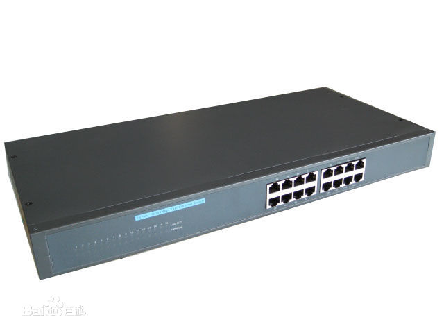
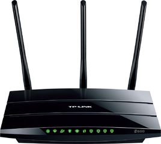

# Technical Report

## Storage

## Network
### IPv4 & IPv6
#### IPv4 
IPv4，是互联网协议（Internet Protocol，IP）的第四版，也是第一个被广泛使用，构成现今互联网技术的基石的协议。1981年Jon Postel 在RFC791中定义了IP，Ipv4可以运行在各种各样的底层网络上，比如端对端的串行数据链路（PPP协议和SLIP协议) ，卫星链路等等。局域网中最常用的是以太网。
#### IPv6
Ipv6是Internet Protocol Version 6的缩写，其中Internet Protocol译为“互联网协议”。IPv6是IETF（互联网工程任务组，Internet Engineering Task Force）设计的用于替代现行版本IP协议（IPv4）的下一代IP协议。
#### 两者对比
与IPV4相比，IPV6具有以下几个优势：
* IPv6具有更大的地址空间。IPv4中规定IP地址长度为32，即有2^32-1（符号^表示升幂，下同）个地址；而IPv6中IP地址的长度为128，即有2^128-1个地址。
* IPv6使用更小的路由表。IPv6的地址分配一开始就遵循聚类（Aggregation）的原则，这使得路由器能在路由表中用一条记录（Entry）表示一片子网，大大减小了路由器中路由表的长度，提高了路由器转发数据包的速度。
* IPv6增加了增强的组播（Multicast）支持以及对流的控制（Flow Control），这使得网络上的多媒体应用有了长足发展的机会，为服务质量（QoS，Quality of Service）控制提供了良好的网络平台。
* IPv6加入了对自动配置（Auto Configuration）的支持。这是对DHCP协议的改进和扩展，使得网络（尤其是局域网）的管理更加方便和快捷。
* IPv6具有更高的安全性。在使用IPv6网络中用户可以对网络层的数据进行加密并对IP报文进行校验，极大的增强了网络的安全性。

### 交换机(Switch)和路由器(Router)
#### 交换机

交换机是一种基于MAC地址识别，能完成封装转发数据包功能的网络设备。它可以为接入交换机的任意两个网络节点提供独享的电信号通路。最常见的交换机是以太网交换机。其他常见的还有电话语音交换机、光纤交换机等。它主要的性能指标有：

* 背板带宽（ BackPlane Capacity ）：背板带宽是模块化交换机专有的概念。它是指交换机背板总线的带宽，是由机箱（ Chassis ）所决定的。背板带宽代表了引擎与业务板之间所能传输的最大数据量，单位为 Gbps 。

* 交换容量（ Switch Capability ）：指引擎 / 交换矩阵或转发芯片的交换能力。与背板带宽一样，单位也是 Gbps 。交换容量与背板带宽的区别在于：交换容量是描述的引擎等有源部件，背板带宽描述的是无源部件――背板总线。对于固定配置交换机而言，因为其没有背板总线，固没有背板带宽这一概念。对于模块化交换机，背板带宽由机箱决定，交换矩阵由引擎决定。举个例子， Cisco 6506-E 机箱的背板带宽是 480Gbps ， SUP720 引擎的交换容量是 720Gbps ，所以若 6506-E机箱配备 SUP720 引擎，它的总带宽也只能是 480Gbps 。

* 包转发率（ Throughout ）：指在加载负荷的情况下，设备能成功转发数据的效率。所谓成功转发，仅表示不丢包，不表示不出错。在描述一个设备的包转发率时必须指明是在多大的加载负荷情况下的值，业界一般选用 64byte 的包作为加载负荷。不同厂商对包转发率有不同的称谓，比如转发速率、吞吐率、转发性能、每秒分组数等等。

#### 路由器

作为一种网络基础设备，路由器提供路由与转送两种重要机制，可以决定封包从来源端到目的端所经过的路由路径（host到host之间的传输路径），这个过程称为路由；将路由器输入端的封包移送至适当的路由器输出端（在路由器内部进行），这称为转送。路由工作在OSI模型的第三层——即网络层，例如网际协议（IP）

##### 计算能力（ComputationCapacity）
路由器的计算能力一般由CPU和ASIC完成，通常在中低端路由器中，CPU负责交换路由信息、路由表查找以及转发数据包。在上述路由器中，CPU的能力直接影响路由器的吞吐量（路由表查找时间）和路由计算能力（影响网络路由收敛时间）。在高端路由器中，通常包转发和查表由ASIC芯片完成，CPU只实现路由协议、计算路由以及分发路由表。由于技术的发展，路由器中许多工作都可以由硬件实现（专用芯片）。CPU性能并不完全反映路由器性能。路由器性能由路由器吞吐量、时延和路由计算能力等指标体现。

##### 路由协议支持：
路由器的路由功能常常基于不同的路由协议:
* 路由信息协议(RIP):RIP是基于距离向量的路由协议，通常利用跳数来作为计量标准。RIP是一种内部网关协议。由于RIP实现简单，是使用范围最广泛的路由协议。该协议收敛较慢，一般用于规模较小的网络。RIP协议在RFC 1058规定。
* 路由信息协议版本2 (RIPv2):该协议是RIP的改进版本，允许携带更多的信息，并且与RIP保持兼容。在RIP基础上增加了地址掩码（支持CIDR）、下一跳地址、可选的认证信息等内容。该版本在RFC 1723中规范化。
* 开放最短路径优先协议版本2 (OSPFv2):该协议是一种基于链路状态的路由协议，由IETF内部网关协议工作组专为IP开发，作为RIP的后继内部网关协议。OSPF的作用在于最小代价路由、多相同路径计算和负载均衡。OSPF拥有开放性和使用SPF算法两大特性。
* “中间系统－中间系统”协议(ISIS):ISIS协议同样是基于链路状态的路由协议。该协议由ISO提出，起初用于OSI网络环境，后修改成可以在双重环境下运行。该协议与OSPF协议类似，可用于大规模IP网作为内部网关协议。
* 边缘网关协议(BGP4):BGP协议是用于替代EGP的域间路由协议。BGP4是当前IP网上最流行的也是唯一可选的自治域间路由协议。该版本协议支持CIDR，并且可以使用路由聚合机制大大减小路由表。BGP4协议可以利用多种属性来灵活地控制路由策略。
* 802.3、802.1Q的支持:802.3是IEEE针对以太网的标准。支持以太网接口的路由器必须符合802.3协议。802.1Q是IEEE对虚拟网的标准。符合802.1Q的路由器接口可以在同一物理接口上支持多个VLAN。
* 对IPv6的支持和对IP以外协议的支持：除支持IP协议外，路由器设备还可以支持IPX、DECNet、AppleTalk等协议。这些协议在国外有一定应用，在我国应用较少，一般不用考虑。

##### 核心性能指标：
* 全双工线速转发能力：路由器最基本且最重要的功能是数据包转发。在同样端口速率下转发小包是对路由器包转发能力最大的考验。全双工线速转发能力是指以最小包长（以太网64字节、POS口40字节）和最小包间隔（符合协议规定）在路由器端口上双向传输同时不引起丢包。该指标是路由器性能重要指标。
* 设备吞吐量：指设备整机包转发能力，是设备性能的重要指标。路由器的工作在于根据IP包头或者MPLS标记选路，所以性能指标是转发包数量每秒。设备吞吐量通常小于路由器所有端口吞吐量之和。
* 端口吞吐量：端口吞吐量是指端口包转发能力，通常使用pps：包每秒来衡量，它是路由器在某端口上的包转发能力。通常采用两个相同速率接口测试。但是测试接口可能与接口位置及关系相关。例如同一插卡上端口间测试的吞吐量可能与不同插卡上端口间吞吐量值不同。
* 背靠背帧数：背靠背帧数是指以最小帧间隔发送最多数据包不引起丢包时的数据包数量。该指标用于测试路由器缓存能力。有线速全双工转发能力的路由器该指标值无限。
* 丢包率：丢包率是指测试中所丢失数据包数量占所发送数据包的比率，通常在吞吐量范围内测试。丢包率与数据包长度以及包发送频率相关。在一些环境下可以加上路由抖动、大量路由后测试。
### 子网掩码（subnet mask）

子网掩码(subnet mask)又叫网络掩码、地址掩码、子网络遮罩，它是一种用来指明一个IP地址的哪些位标识的是主机所在的子网，以及哪些位标识的是主机的位掩码。子网掩码不能单独存在，它必须结合IP地址一起使用。子网掩码只有一个作用，就是将某个IP地址划分成网络地址和主机地址两部分。

通常情况下，子网掩码的表示方法和地址本身的表示方法是一样的。在IPv4中，就是点分十进制四组表示法（四个取值从0到255的数字由点隔开，比如255.128.0.0）或表示为一个八位十六进制数（如FF.80.00.00，它等同于255.128.0.0），后者用得较少。

另一种更为简短的形式叫做无类别域间路由（CIDR）表示法，它给出的是一个地址加上一个斜杠以及网络掩码的二进制表示法中“1”的位数（即网络号中和网络掩码相关的是哪些位）。例如，192.0.2.96/28表示的是一个前28位被用作网络号的IP地址（和255.255.255.240的意思一样）。

**子网掩码的好处就是**：不管网络有没有划分子网，只要把子网掩码和IP地址进行逐位的“与”运算（AND）即得出网络地址来。这样在路由器处理到来的分组时就可以采用同样的方法。

### DNS服务器（DNS Server）
DNS（Domain Name Server，域名服务器）是进行域名(domain name)和与之相对应的IP地址 (IP address)转换的服务器。DNS中保存了一张域名(domain name)和与之相对应的IP地址 (IP address)的表，以解析消息的域名。 域名是Internet上某一台计算机或计算机组的名称，用于在数据传输时标识计算机的电子方位（有时也指地理位置）。域名是由一串用点分隔的名字组成的，通常包含组织名，而且始终包括两到三个字母的后缀，以指明组织的类型或该域所在的国家或地区。

DNS是计算机域名系统 (Domain Name System 或Domain Name Service) 的缩写，它是由域名解析器和域名服务器组成的。域名服务器是指保存有该网络中所有主机的域名和对应IP地址，并具有将域名转换为IP地址功能的服务器。其中域名必须对应一个IP地址，一个IP地址可以有多个域名，而IP地址不一定有域名。域名系统采用类似目录树的等级结构。域名服务器通常为客户机/服务器模式中的服务器方，它主要有两种形式：主服务器和转发服务器。将域名映射为IP地址的过程就称为“域名解析”。
#### 查询模式
有两种询问原理，分为Recursive和Iterative两种。前者是由DNS代理去问，问的方法是用Interative方式，后者是由本机直接做Interactive式的询问。由上例可以看出，我们一般查询名称的过程中，实际上这两种查询模式都是交互存在着的。
* 递归式(Recursive):DNS客户端向DNS Server的查询模式，这种方式是将要查询的封包送出去问，就等待正确名称的正确响应，这种方式只处理响应回来的封包是否是正确响应或是说是找不到该名称的错误讯息。
* 迭代式(Iterative):DNS Server间的查询模式，由Client端或是DNS Server上所发出去问，这种方式送封包出去问，所响应回来的资料不一定是最后正确的名称位置，但也不是如上所说的响应回来是错误讯息，他响应回来的是部分信息，告诉你所查询域名中的下一级域的域名服务器的地址信息，然后再到此域名服务器上去查询所要解析的名称，反复动作直到找到最终信息。

#### 域名解析技术
* 静态域名解析：Internet上的域名解析一般是静态的，即一个域名所对应的IP地址是静态的，长期不变的。也就是说，如果要在Internet上搭建一个网站，需要有一个固定的IP地址。
* 动态域名解析：动态域名解析服务，是将用户的动态IP地址映射到一个固定的域名解析服务上，用户每次连接网络的时候，客户端程序就会通过信息传递把该主机的动态IP地址传送给位于服务商主机上的服务器程序，服务程序负责提供DNS服务并实现动态域名解析。就是说DDNS捕获用户每次变化的IP地址，然后将其与域名相对应，这样域名就可以始终解析到非固定IP的服务器上，互联网用户通过本地的域名服务器获得网站域名的IP地址，从而可以访问网站的服务。
## XPU

> #### What is processing unit？
>常见的 CPU，GPU 中的 PU（Processing Unit) 是处理单元的意思。在一般的认知之中，CPU 负责处理程序运行的各种运算处理，而 GPU 则专门负责图形图像方面的处理和输出。随着AI 的热潮，又涌现出了 TPU 和 NPU 等等处理单元，他们都针对机器学习有着不同方面的优化，更符合专属的运用场景。接下来我们会以 GPU 和 TPU 为例，分别分析他们的特点和特定用途
---

### GPU
---
#### Introduction
GPU( Graphic Processing Unit)，是为了减轻 CPU 的图像处理压力而专门设计出来的图像处理器。

### Features
* 运算资源非常丰富
* 控制部件占的面积比较小内存带宽大，目前独显都采用 GDDR5 显存，位宽也高，主流独显内存带宽是CPU的十倍（200GB/s 对比 20GB）
* 内存延迟高，对比 CPU 使用多级缓存掩盖延迟，GPU 采用多线程掩盖延迟
* 寄存器资源极为丰富，32bit 寄存器有 64k 个，单线程可用 255 个

#### Pros
与特点相对应的，GPU 的优点在于数据吞吐量大，并行计算能力高
#### Cons
Latency 很高，不适合处理大量的分支
需要高度的数据对齐

#### Indicators
* **GPU浮点计算能力**：浮点计算能力是科学计算关注的重点，是衡量GPU协处理器性能的最重要指标

* **GPU访存带宽**：计算核心对内存（显存）和各级缓存（存储）的读写能力

* **GPU通信带宽**：GPU是协处理器，与CPU端存储是分离的，故GPU运算时必须先将CPU端的代码和数据传输到GPU，GPU才能执行kernel函数。涉及CPU 与GPU通信，其中通信接口PCI-E的版本和性能会直接影响通信带宽，此外，主机端口内存分页方式也将直接影响通信带宽

#### Application
* 图形计算
GPU 设计之处就是为了让 CPU 从繁重的图形计算之中解放出来，各司其职

* Deep Learning
用于图形计算的 GPU 有着极高的计算能力、并行计算能力和数据吞吐量，同时图形计算中的矩阵运算可以完成深度学习中卷积神经网络中的卷积运算和矩阵运算。所以深度学习可以通过 GPU 来进行加速。

### TPU
---
#### Introduction
TPU（Tensor Processing Unit）: Google为机器学习定制的专用芯片（ASIC），专为Google的深度学习框架TensorFlow而设计。

#### Features
与图形处理器（GPU）相比，TPU采用低精度（8位）计算，以降低每步操作使用的晶体管数量。降低精度对于深度学习的准确度影响很小，但却可以大幅降低功耗、加快运算速度。同时，TPU使用了脉动阵列的设计，用来优化矩阵乘法与卷积运算，减少I/O操作。此外，TPU还采用了更大的片上内存，以此减少对DRAM的访问，从而更大程度地提升性能。

#### Indicators
* **浮点计算能力**：每个 Cloud TPU 可提供最高每秒 180 万亿次浮点运算的计算性能
* **内存的带宽**：每个 Cloud TPU 可提供最高 64 GB 的超高带宽内存。
#### Application
谷歌用 TPU 来加速机器学习，并搭建了 Cloud TPU 平台来增强自己的云服务

